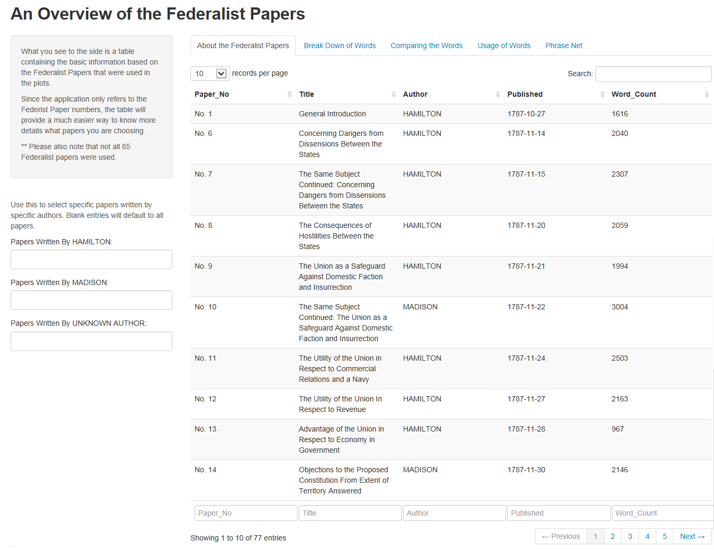
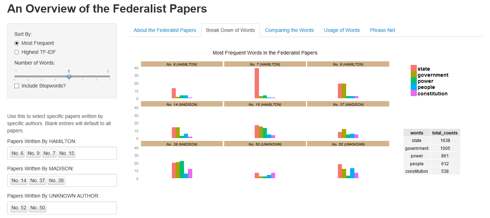
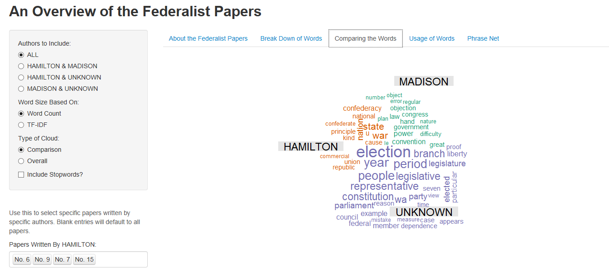
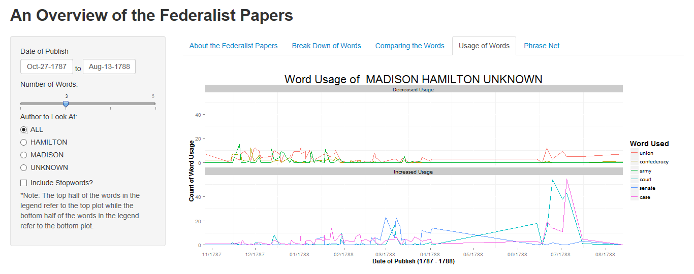
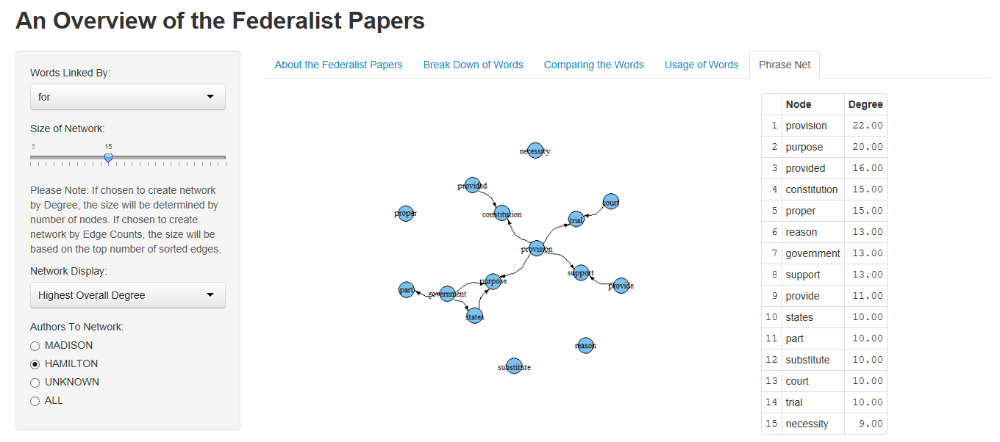

Project: Final Project
==============================

| **Name**  | Charles Yip  |
|----------:|:-------------|
| **Email** | ckyip@dons.usfca.edu |


Instructions To Run Shiny App
------------------------------
To run the prototype shiny app, you can run the following:

```
library(shiny)
runGitHub("msan622", "chrono721", subdir = "final-project")
```

However, because of the datasets that you need to run the shiny application, I suggest that you download the source code and the datasets directly and run the application locally. 

To run the plots, you must have these packages installed:

- `ggplot2`
- `scales`
- `reshape`
- `wordcloud`
- `gridExtra`
- `igraph`


About Datasets and Transformations
------------------------------
The dataset that I chose to use is called the Federalist Papers. This is a collection of 85 articles written by Madison, Hamilton and Jay. Although man of these articles have known authors, there are 11 papers where the authors are unknown. However, these unknown authors have been determined to be either Madison or Hamilton. Because of this, I opted to only focus on papers not written by Jay as there is limited insight that we can gather from his papers.

I download the raw text file from ProjectGutenberg and used a Python script to split up the data into these following datasets:
- Counts of the words per each paper (at least 5 word frequency)
- TF-IDFs of the words per each paper (at least 5 word frequency)
- Basic information: Title, Author, Date of Publish, and Word Counts
- Adjacency Matrices for the Phrase Net. This contains a lot of tables because I needed a separate matrix for each of the connecting words as well as the ones for each author. 

The Python Script I used to extract this information is also included on my github as 'Extract.py', but do not run the script directly as you will need to edit certain parameters within the script and to run certain sections of the code over again to produce all of the datasets needed. 

All analysis of the datasets done for the plots have been done in R.


Discussion
------------------------------
The main focus of this application is an exploratory one. Unlike many of my classmates, I did not include predictions, forecasts, or any kind of interesting overall insight. Because the nature of my dataset is raw text, my main focus was to try to incorporate many different visualizations that the user can play around with and come up with their own conclusions. 

Techniques

Interactivity


What you see here is a table containing the basic information of each of the papers used in the shiny applications. 

I wouldn't exactly call this table a visualization, but rather a reference point to come back to when you want to know details about each paper. The bottom left area of this table allows you to select exactly which papers you would like to be included. You can even sort by the word count, the author, and other features as well. If you'd like, you can choose between viewing 5, 10 or 20 titles per page. I didn't want to display more than that or the user would have to scroll down a lot to see everything. 


What you see here is a multiple bars plot that displays the counts of the most frequent words over all of the papers divided up by each paper selected. 

This visualization was created by taking the word counts per each paper and creating a histogram based on the counts. Fortunately there is an option within geom_bar to allow us to do this easily. The plot is also faceted by the paper which you can select via the bottom left options. A table is even included on the bottom right to give perspective as to how the words were chosen as it is hard to see this individually through each plot. If the amount of papers chosen is over 25, only a random 25 out of those papers will be selected to be displayed. The reason for this is that any more papers plotted this way will unfortunately be too small to derive any real analysis from. 

Options for this plot include sorting by the most frequent word or the Highest TF-IDFs. In addition, you can include stopwords as well as look at more words in each of the bar plots. These options allow you to delve in futher to the data and create comparisons that you wouldn't get if you used all of the papers. 

- Lie Factor: The lie factor here is pretty low. There are y-labels that show you exactly how tall each of the bars are. The bars are all equally shaped so that the lie factor isn't too bad. It may be a little hard to compare from paper to paper since they are pretty far apart, but I think the y-axis labels on the side will help with this. Perhaps very light gridlines would've helped more.
- Data Density: The density is rather low. This is the reason I kept the options to only include 8 words. Any more than that, and the plots themselves would become overcrowded and hard to interpret.
- Data to Ink Ratio: The ratio is close to 1. The thing about bar plots is that they simple allow you to compare the counts.

What I learned most from this visualization is that Hamilton has the least diverse vocabulary. When I look at Hamilton's bar plots, I see that he often uses one word very often over the course of his writings. Madison on the other hand tried to use the words equally over time. 



What you see here is a comparison wordcloud that displays a comparison between the authors. An option is included to switch between different wordclouds. 

This visualization contains a comparison cloud as well as a normal word cloud. This visualization was created to help users compare between the three authors. You can even select certain papers using the bottom left interface again! Other features of this plot is that you can choose exactly who to compare against as well as what to compare on (frequency or tfidfs). In addition, if you wanted to, you could include stopwords as well. These options allow you to delve in futher to the data and create comparisons that you wouldn't get if you used all of the papers. 

Options for this plot include grouping by the most frequent word or the Highest TF-IDFs. In addition, you can include stopwords. You can also change the comparison wordcloud into a simple wordcloud implementation. 

- Lie Factor: This is pretty high. Unfortunately with wordclouds, the length of the word often plays a big factor on how much space the word takes up. Since the word font size was based on frequency, some words may seem more important than they really are. Unfortunately, this is a general problem for word clouds, which is why I opted to use a comparison cloud.
- Data Density: In this case, the density isn't too bad. I limited the amount of words being plotted to the wordcloud because the more words there are, the more cluttered the plot gets. 
- Data to Ink Ratio: This is also pretty bad because the amount of data being encoded is only the counts. The comparison plot makes this better, but in general wordclouds have a pretty bad data to ink ratio.

Something interesting about the comparison cloud is that Madison's words are usually never very big. Carrying on my observation from the previous plot, we can see that Madison has a large vocabulary, but tried to use his words more equally than Hamilton.


What you see here is a multiple lines plot containing the words that had the most increased usage and the most decreased usage over time. 

This visualization tried to illustrate a difference in word usage over time. Using an algorithm I developed, the plot selects the top n words that would highlight this difference in word usage. 

Options for this plot include zooming. You can choose the dates in which you can view the line. Also, you can choose which authors to plot. Because authors published over different times, some authors will only contain certain sections of the overall line. This is where the zooming feature will come in handy as you can zoom in closer to the author's writing style. 

- Lie Factor: There is pretty small lie factor. Line Plots in general have very little lie factor since nothing from the plot is misconstrued. Perhaps because I opted to facet the plots horizontally, the lines have been squished down making it hard to tell if there is any difference at all. 
- Data Density: The data density depends on how many words you decide to look at. If you increase the number of words, the density will go up simply because there are more lines being plotted together. 
- Data to Ink Ratio: This is a similar issue with the data density as it will depend on the number of words you decide to look at. 

Something interesting I learned from this plot is the fact that there is really no easy pattern to see from this. This in itself is interesting as all of the authors seemed to have a pretty similar writing style throughout the years. The only spikes from the graph come from articles that focus on that word.



What you see here is a phrase net containing information on how the words are connected in the papers. 

This visualization is a directed network graph which tells us how the words or connected. The point of this plot is to display only the most interesting information, and not worry about looking at the whole picture as it would be very hard to do so. The visualization offers two ways to look at the plots: Edge Counts or Degree. Both of these offer very different interpretations. Edge Counts refers to frequency. If the author uses a particular order a lot, that will be reflected in the plot. The Degree shows the variety of the words the author uses. In addition, a table detailing the information for the top 15 nodes or edges are displayed allowing us to get a sense of scale. 

Options for this plot include a way to change the linking word. You have a choice of 5 different linking words here. In addition, a slider bar detailing how the network should be displayed is also included. This slider bar may be confusing to interpret, but the main idea to get out of this is that the higher the bar goes, the bigger your network will be. In addition, we can also choose between different authors to network. The idea is to compare networks between the authors.

- Lie Factor: There is quite a bit of lie factor mainly because the network is being subsetted to display a certain amount of information. For example, the word Provision here is supposed to have a degree of 22. That means that technically there should be 22 lines coming in and out of that word, but because we subsetted the network, only 4 is displayed here. The table on the right is to prevent misunderstandings like this. 
- Data Density: This depends on how many nodes you decide to plot. The more nodes you plot, the higher the density will be. If the number of nodes gets too high, you won't be able to see the edges anymore. The current setting of 10 is usually a good number to start on.
- Data to Ink Ratio: Again, this depend on how many nodes you decide to plot. An entire adjacency matrix is being displayed here, but the amount of data being displayed unfortunately doesn't scale in the same way as the ink does since more nodes will have to be plotted. 

One very interesting thing from here is simply how well the networks turned out in general. I thought the plots would be a very big mess making no sense, but I was pleasantly surprised. The words make sense, and also tell us a little about how the words are connected with each other. One thing I learned from this is that all of the words seem to cluster into governmental words such as "government" or "States". This seems to be a common trend with all of the papers.  

Prototype Feedback
------------------------------
The prototype exercise was a very useful experience for me, not only for the feedback that I received, but the exposure to other people's ideas and projects as well. For example, I did not know how to change the sidebar parameters when I switched tabs, but looking at other people's applications in my group, I was able to figure it out!

The original prototype had 3 visualizations and a template for the shiny application. However, the shiny application itself was very poorly designed. The interactivity was displayed very poorly within the applications and people were very confused by the layout in general. The visualizations were decent, and not a lot of comments were made about them.

Out of all the comments, here are the changes that I made from them:
- Added a summary table
- Changed the layout of the control panels

The feedback I found most particularly helpful were the ones that explained to me exactly how I could implement a certain technique. For example, an explanation of what functions to look into for implementing a navigation bar, or conditional tab panels were the most helpful as I did not need to spend time looking for these functions online. 

There is really only one comment that I did not agree with in the feedback; Implementation of a prediction model. Perhaps if I had more time, I could produce some kind of model that would predict the unknown papers, but I didn't believe that this was the focus of this project. I wanted to spend most of my time on the visualizations and not time spent on coding a predictive model. In addition, I wouldn't really know how to make the prediction model interactive or visually interesting. Most prediction models have very statistical visualizations and would need explanation to explain them, and the outcome should always be the same no matter what kind of parameters you should choose. I just don't think a predictive model would've been very good in my application.


Challenges
------------------------------
Below are a list of challenges that I faced while setting all of this up:

- Implementing a Submit Button: One of the biggest issues that I've seen is that the plot redisplays every time a user adds or deletes a paper. This is a big problem when a person changes a lot of papers all at once since a plot will be rendered for each one. I thought a good solution would be to implement a submit button where you could simply click the button to submit the papers. Unfortunately, there is very little documentation on this, and the biggest problem is that the conditional control panels that I had implemented only change when the submit button is pressed. 
- Making the Multiple Line Plots Display Well: The algorithm that I use to determine the overall usage of a particular word unfortunately does not work very well. The algorithm worked well on previous assignments, but unfortunately, we cannot see that here. The numbers don't lie, and there is a difference between the usage in the past and the present, but there isn't enough of a difference to show that here. 
- Inserting tables into the ggplots: Inserting a simple table into the graph proved to be very difficult as well. Searching online, there is no easy way to do this, and I ended up having to draw the table and legend separately and inserting it back into the ggplot.
- Creating all of the datasets: The most trouble I had was figuring out a good way to create the phrase nets. I wanted to include a lot of optional choices, but for each choice, I needed to create a separate adjacency matrix for each one. Creating these datasets were pretty difficult and takes a while to actually load into R. However, I don't know a better way to do this except to reduce the adjacency matrix. 


