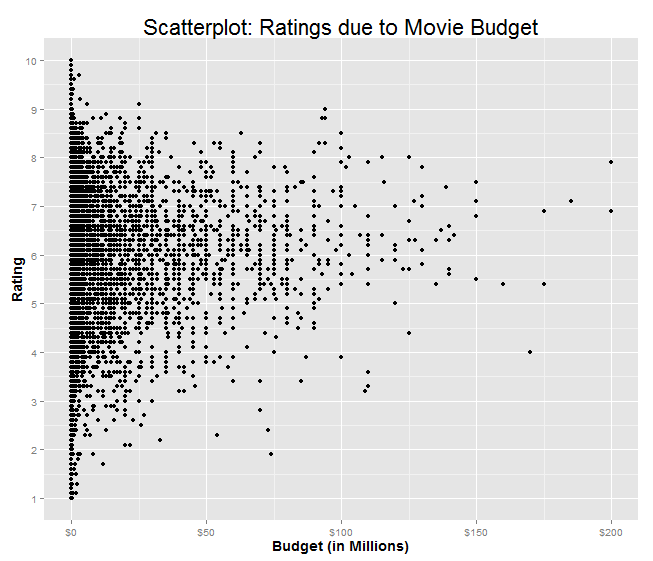
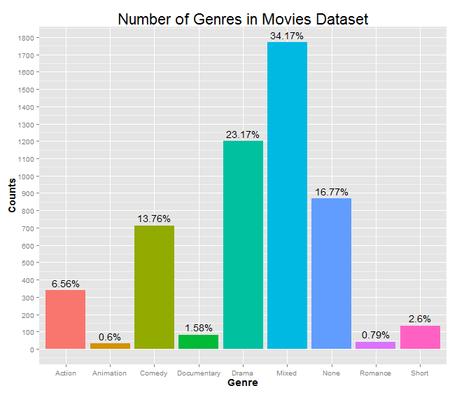
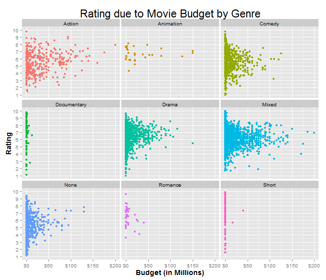
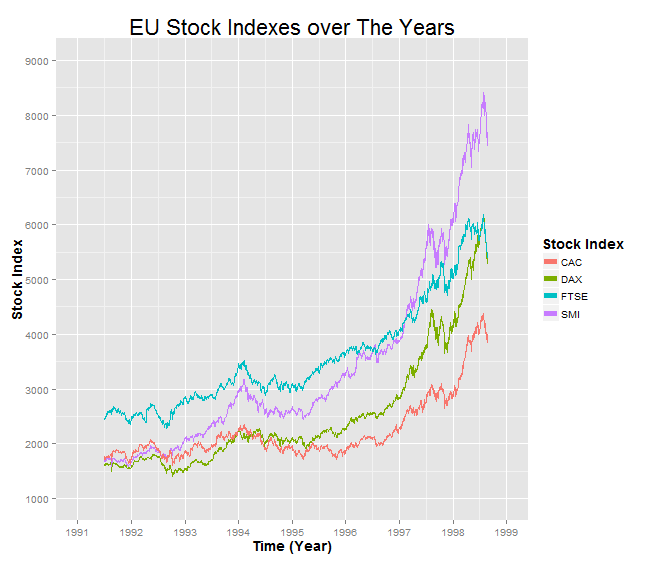

Homework 1: Basic Charts
==============================

| **Name**  | Charles Yip |
|----------:|:-------------|
| **Email** | ckyip@dons.usfca.edu |


## Instructions ##

Below will contain the answers to the homework 1 questions. Instruction for running the official code is down below. However, I will snippets from the code down below to explain how the plot was generated. 

The following packages must be installed prior to running this code:

- `ggplot2`
- `scales`

To run this code, please enter the following commands in R:

```
library(devtools)
source_url("https://raw.github.com/chrono721/msan622/homework1/MSAN622_HW1.r")
```


## Discussion ##

Before any of the plots were run, the data needed to be transformed. Some transformations to the data were provided, but others were not. I will list the effect of the transformations here. 

1. Get rid of NA's from 'movies' dataset.
2. Delete data points where the 'budget' from 'movies' dataset is 0 or below.
3. Consolidate the genre's from 'movies' into one column called 'genre.
4. Create a table of genre counts to use for the bar chart.
5. Transform the 'EuStockMarkets' dataset into a data frame that has 'time' and the stock indexes.

In addition, for each plot, I changed the font size of the axis labels and the titles to make them more clear. This edit will not be explained in individually since I applied this option to all of the plots.
 

Plot 1
------------------------------
**Plot 1: Scatterplot.** Produce a scatterplot from the `movies` dataset in the `ggplot2` package, where `budget` is shown on the x-axis and `rating` is shown on the y-axis. Save the plot as `hw1-scatter.png`.

```R
plot1 <- ggplot(data = movies, aes(x=budget/1000000, y=rating)) +
         ggtitle("Scatterplot: Ratings due to Movie Budget") +
         geom_point(na.rm = TRUE) +  xlab("Budget (in Millions)") +  ylab("Rating") +
         scale_x_continuous(labels = dollar) + 
         scale_y_continuous(breaks = seq(1,10,1)) + 
         theme(axis.title=element_text(size=14,face="bold"), title = element_text(size=18))
print(plot1)
```

The following code will produce this plot:


For this plot, I simply used geom_point to plot the points directly into the plot. In case there were any NA's left in the dataset that weren't removed, I added the na.rm = TRUE to make sure there were no problems. In addition, I changed the x-axis labels to display in millions of dollars to make the values more clear. I also changed the y-axis labels to display in increments of 1 which is the standard for rating systems. I decided not to add color because the colors made the scatterplot look messy.

This point of this plot is to see if there is a relationship between the movie's budget and its ratings. 


Plot 2
------------------------------
**Plot 2: Bar Chart.** Count the number of action, adventure, etc. movies in the `genre` column of the `movies` dataset. Show the results as a bar chart, and save the chart as `hw1-bar.png`.

```R
plot2 <- ggplot(data = movies, aes(x=factor(genre), fill = genre)) + 
         ggtitle("Number of Genres in Movies Dataset") + scale_y_continuous(breaks = seq(0,2000,100))+
         geom_text(data=freq,aes(x=genre, y = Freq, label = Percent), vjust=-0.5) +
         geom_bar(na.rm = TRUE) +  xlab("Genre") +  ylab("Counts") +
         guides(fill=FALSE) + 
         theme(axis.title=element_text(size=14,face="bold"), title = element_text(size=18))
print(plot2)
```

The following code will produce this plot:


For this plot, I factored genre and used geom_bar to plot the bar chart. Like with Plot1, I used na.rm = TRUE to make sure there were no problems with missing values. Color was added to distinguish between bars better, and the legend was removed since it is redundant to include. In addition, the y-value tickmarks were changed to read the bar's value much easier. Also, percentages were added to the top of the bars to highlight the composition of the movies dataset.

The point of this plot is to get a general sense of what kind of movies the dataset has collected. 


Plot 3
------------------------------
**Plot 3: Small Multiples.** Use the `genre` column in the `movies` dataset to generate a small-multiples scatterplot using the `facet_wrap()` function such that `budget` is shown on the x-axis and `rating` is shown on the y-axis. Save the plot as `hw1-multiples.png`.

```R
plot3 <- ggplot(data = movies, aes(x=budget/1000000, y=rating, color = factor(genre), group=factor(genre))) + 
         ggtitle("Rating due to Movie Budget by Genre") + 
         geom_point(na.rm = TRUE) +  xlab("Budget (in Millions)") +  ylab("Rating") + 
         facet_wrap(~ genre, ncol = 3) + guides(color=FALSE) +
         scale_x_continuous(labels = dollar) + 
         scale_y_continuous(breaks = seq(1,10,1)) + 
         theme(axis.title=element_text(size=14,face="bold"), title = element_text(size=18))
print(plot3)
```

The following code will produce this plot:


For this plot, I simply used geom_point to plot the points directly on the plot and then used facet_wrap to separate by genre. In case there were any NA's left in the dataset that weren't removed, I added the na.rm = TRUE to make sure there were no problems. Color was added to distinguish easily between plots. In addition, I changed the x-axis labels to display in millions of dollars to make the values more clear. I also changed the y-axis labels to display in increments of 1 which is the standard for rating systems. The legend was removed because it was redundant.

The point of this plot is to see if there is a relationship between the movie's budget and its ratings within its subcategories. 


Plot 4
------------------------------
**Plot 4: Multi-Line Chart.** Produce a multi-line chart from the `eu` dataset (created by transforming the `EuStockMarkets` dataset) with `time` shown on the x-axis and `price` on the y-axis. Draw one line for each index on the same chart. 

```R
plot4 <- ggplot(data = eu, aes(x=time)) + 
         geom_line(aes(y=DAX, color = "DAX")) + 
         geom_line(aes(y=SMI, color = "SMI")) + 
         geom_line(aes(y=CAC, color = "CAC")) + 
         geom_line(aes(y=FTSE, color = "FTSE")) + 
         ggtitle("EU Stock Indexes over The Years") +  
         xlab("Time (Year)") +  ylab("Stock Index") +
         labs(color="Stock Index") + 
         scale_x_continuous(breaks = seq(1991,1999,1), limits=c(1991, 1999)) + 
         scale_y_continuous(breaks = seq(1000,9000,1000), limits=c(1000, 9000)) + 
         guides(size=FALSE, color=guide_legend(override.aes=list(size=c(2,2,2,2)))) + 
         theme(axis.title=element_text(size=14,face="bold"), title = element_text(size=18))
print(plot4)
```
The following code will produce this plot:


For this plot, I used geom_line multiple times to plot multiple lines in the same plot. For each line, I used a different Y value as well as a different color labels to distinguish between the stocks. Both the X and Y axis labels have been changed to include smaller increments as well as wider ranges. The default labels did not include labels below the minimum value, which made the time series plot harder to understand. In addition, the legend labels were increased in size so that the viewer can make out the colors easier. 

This point of this plot is to see the increase in EU Stock Indexes over the years. 


