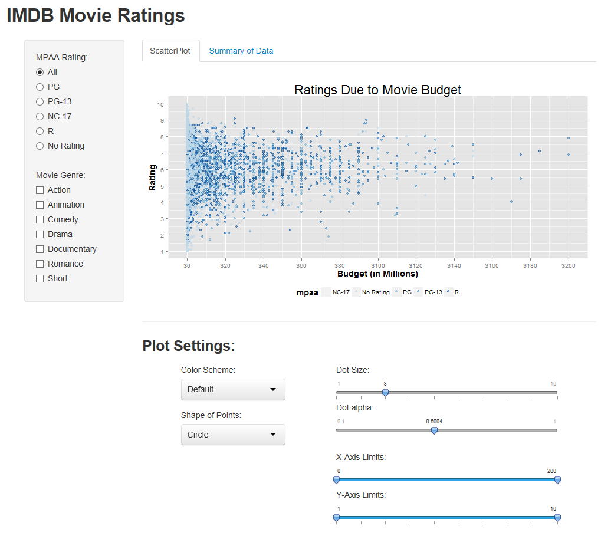
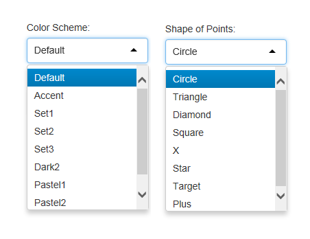
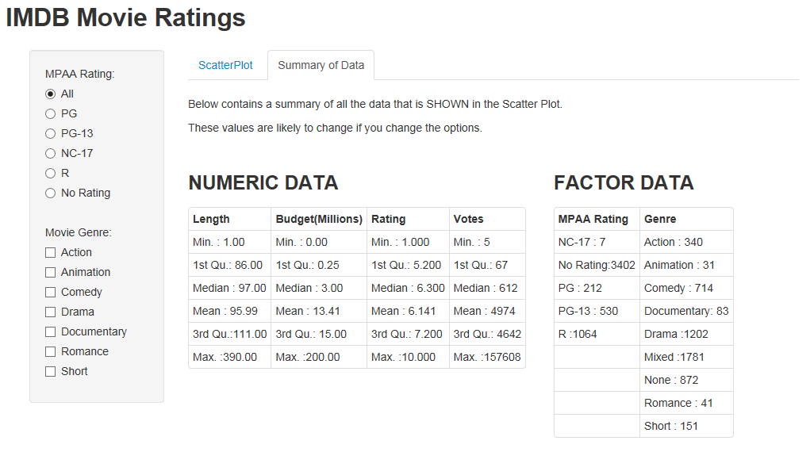
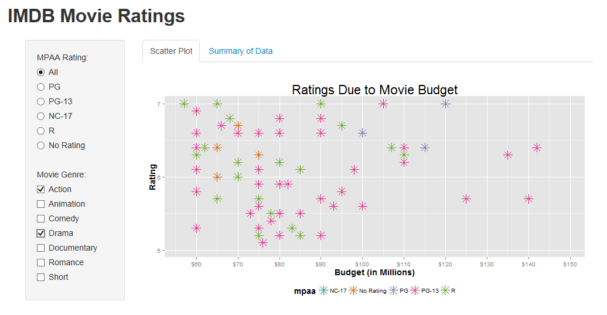

Homework 2: Interactivity
==============================

| **Name**  | Charles Yip  |
|----------:|:-------------|
| **Email** | ckyip@dons.usfca.edu |

## Instructions ##

The following packages must be installed prior to running this code:

- `ggplot2`
- `shiny`
- `scales`

To run this code, please enter the following commands in R:

```
library(shiny)
shiny::runGitHub('msan622', 'chrono721', 'homework2')
```

This will start the `shiny` app. See below for details on how to interact with the visualization.

## Main Features##

The `shiny` app created contains the following features:

- **Radio Buttons:** For changing the MPAA ratings
- **Group Checkboxes:** For subsetting by Movie Genre
- **Drop Down Selects:** For choosing Color Schemes and Shape of Points
- **Sliders:** For controlling point size and transparency
- **Range Sliders:** For viewing data within certain X and Y ranges
- **Tabs:** To view the summary information about the data

## Discussion ##

When you run the app, you should see something like this appear:



As you can see, the sub-setting information in on the left panel while the setting for the plot are down below. The format of this app was created by using this following layout. The parenthesis have been eliminated so that you can see the overall structure for the app.
```
fluidPage
  titlePanel("TITLE")
  sidebarPanel("SUBSETTING OPTIONS")
  mainPanel
    tabsetPanel
      tabPanel
	    fluidRow("PLOT")
	    fluidRow
	      column("DROPDOWNS")
	      column("SLIDERS")
	  tabPanel("TABLE")   
```

**SUB-SETTING DETAILS**
```
radioButtons()
```
The radio buttons controlling the MPAA rating will allow you to see the points that only have that rating. All the other points will disappear. Note that the color of the MPAA rating will stay the same even if the other points disappear.

```
checkboxGroupInput()
```
The check boxes controlling the genre will subset the data based on the genres. If no boxes are selected, all of the data will display. 

**PLOT SETTINGS DETAILS**
```
selectInput()
```
There is an option to change the color scheme. The default is set to whatever scale_colour_brewer() sets it to. 

There is also an option to change the shape of the points. There are a lot of different shapes, but I have selected a few that could potentially be useful. 

Below are the options for each of the drop downs:


```
sliderInput()
```
The slider for the Dot Size will control how large the dots will show up. By default, I set this value to 3. 

The slider for the Dot Alpha will control how transparent each dot is. By default, I set this value to 0.5. However, there seems to be an issue where even though I set the value to 0.5, the slider has a margin of error. I do not know why this occurs, but it does not impact the graph significantly. 

The sliders for the X-Axis and Y-Axis control what part of the graph is shown. There might be questions such as "What are the ratings when our budget is between 100 million and 150 million?" These sliders will help to zoom in on the particular section that you would like to look at.


**Summary of Data Tab**

Now that we have covered the main page, let's take a look at the other tab.



From here, you can take a look at basic statistics based on the data from the Scatterplot. These values WILL CHANGE based on what is displayed on the scatterplot. Because exact values of the data is so hard to see, this tab will make it very easy to summarize the data. 


**EXAMPLE:**

Below, you can find an example of some of the different features of this app.



| **Subsetted**  | |
|----------:|:-------------|
| **Email** | |
|----------:|:-------------|
| **Email** | |
|----------:|:-------------|
| **Email** | |

This plot has been subsetted by Action and Drama. 
Color Scheme: Dark2
Shape of Dot: Star
Size of Dot: 5
Alpha of Dot: 1
X-Axis: 57 to 149
Y-Axis: 5 to 7

 
