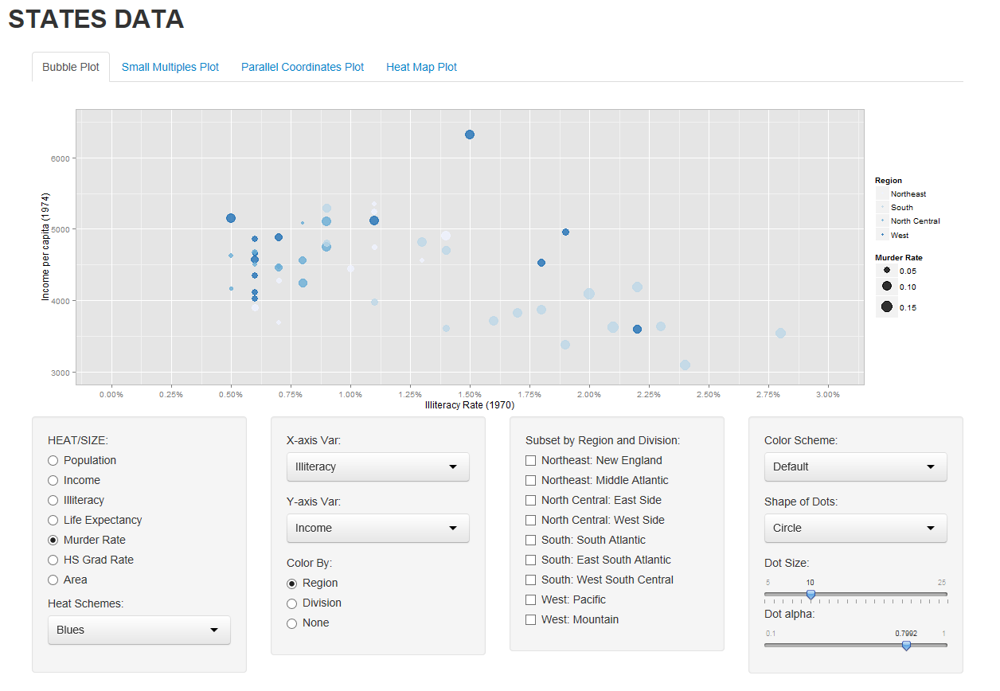
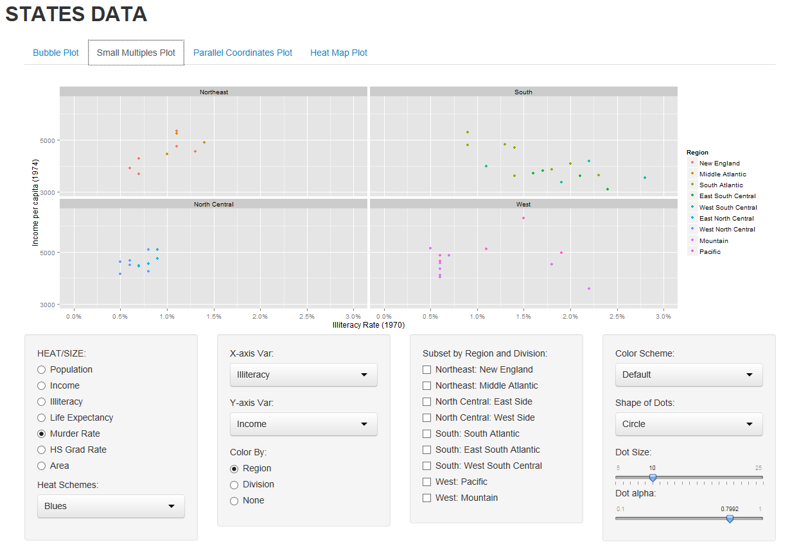
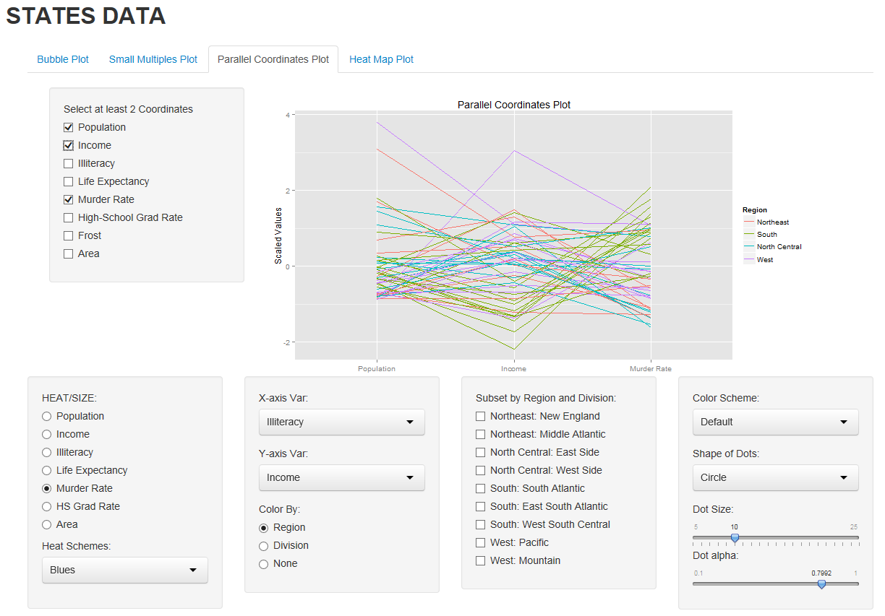
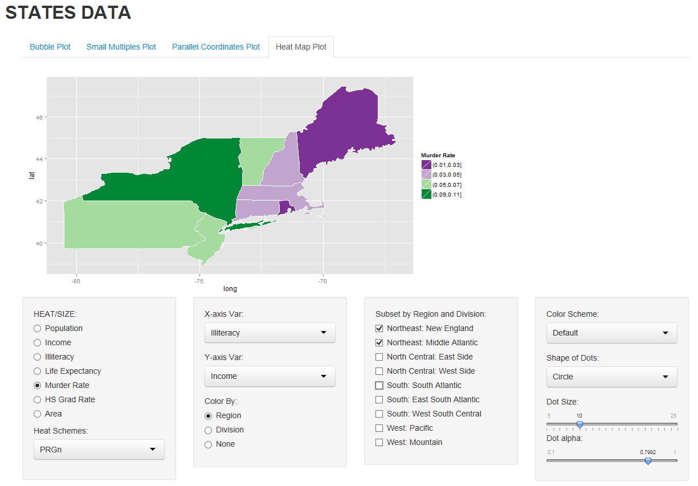

Homework 3: Multivariate
==============================

| **Name**  | Charles Yip  |
|----------:|:-------------|
| **Email** | ckyip@dons.usfca.edu |

## Instructions ##

My `shiny` app should be able to run remotely using the following code:

```
library(shiny)
runGitHub("msan622", "chrono721", subdir = "homework3")
```

Also, please have the following libraries installed to run the code:

- `RColorBrewer`
- `ggplot2`
- `shiny`
- `scales`
- `datasets`
- `GGally`

Some of these come with the Base R package, but I am just including them here for completeness sake.

## Discussion ##

I will first talk about the features that I have implemented in my shiny app. They're not all implemented in each of the plots, so I will refer back to them in the specific plots. 

- Zooming: In the heatmap, you can zoom into the map by selecting what Divisions you want to see plotted. This way, if you wanted to look at a trend between certain states, you can zoom in an get a clearer picture without having any of the other states interfere.
- Filtering: In this application, there are so many ways you can filter the data. You can subset the data by Division and you can specify what variables you would like to plot in all of the plots. There are a lot of options, and a lot of data to explore! I encourage that you try other values from the default selected values.


**Bubble Plot**



I chose this technique because it's a way to visualize multi-dimensional data in a 2-D space. Because the data that we were sent had a lot of columns, a bubble plot would show some very interesting interactions.

By default, I chose to display the dots by plotting Illiteracy and Income on X and Y coordinates. This think this would establish that there is some sort of negative correlation between Illiteracy and Income. I then decided to choose Murder Rate as the bubble size so that we can see how both Illiteracy and Income affect murder rates. A bit depressing, but could give us some insight as to where to pass better laws, increase minimum wage, or hire more police enforcement. To get a better idea of the locations of the murders, I then divided the color up into Regions. 

In this case, I could see how the bubbles could be hard to see, so I suggest changing the color palette to something with a little more contrast. I also suggest trying out different variables as the subsetting options will work on this plot. 


**Small Multiples: Scatter Plot**



I chose Small Multiples because I wanted to allow the person to view the general trend of each region. I originally planned to include a regression line through each plot to further illustrate the trends, but I unfortunately ran out of time. 

By default, I chose to display the dots by plotting Illiteracy and Income on X and Y coordinates. Something interesting to note is that we can see that the Northeast and North Central areas have a more positive trend than the South and West areas. This MAY lead us to think that the North areas are better off. However, we can see that this is mainly due to the fact that the North areas have a lower illiteracy rate in general. 

If one wanted to subset this even further into divisions, one can simply select the "color by" option and set it to Division. This will allow the plots to split up even further. You can also filter out data by selecting what areas you want to see. The plot will enlargen since there are less plots to draw. 


**Parallel Coordinates Plot**



I chose the parallel coordinates because the assignment forced me to. In general, I actually like the idea of a parallel coordinates plot because it becomes harder to interpret as you put more data into it. In addition, I think we could get more information out of a bubble plot or a heat map than this. However, for what it's worth, there do seem to be some interesting trends in the data.

By default, I chose to display the dots by plotting Population, Income and Murder Rate as the coordinates. We can see that there seems to be a high correlation between low income and high murder rates! We can also slightly see that population has little effect on the overall trends of murder and income. 

If we wanted to add more coordinates to the plot, we can use the special option on the left that is only available on this plot. As long as we select 2+ variables, it will create the plot. Otherwise, all of the variables will be plotted. Unfortunately, we can not order the variables in any way we want as the data is in a fixed order. 

I would suggest subsetting the data much further so that we can see clearer trends in the data without other colors getting in the way. 


**Heat Map**



I chose to plot a heat map because the data lends itself very well to heatmaps. Because we are dealing with locational data, the other plots have a hard time getting the point across that sometimes these trends are due to proximity of certain states to each other. We can see that when we color by region or division, but sometimes, there is simply not enough granularity. 

In this plot, I have zoomed up on a view of the Northeast. The heatmapis measuring Murder Rates. We can clearly see that New England has a very low murder rate while the Middle Atlantic has a high murder rate even though they are very close to each other. 

There are many options here that don't have any affect on the plots. In addition, this is the only plot that uses Heat Schemes as using the Color Schemes provided doesn't make any sense in this case since we are not using factor data in the color. 


