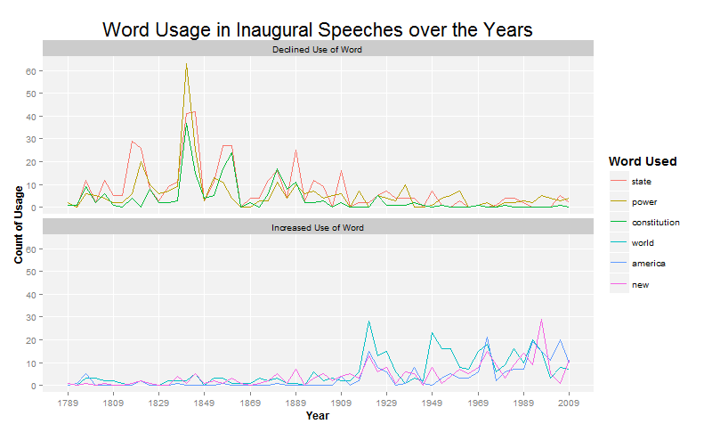
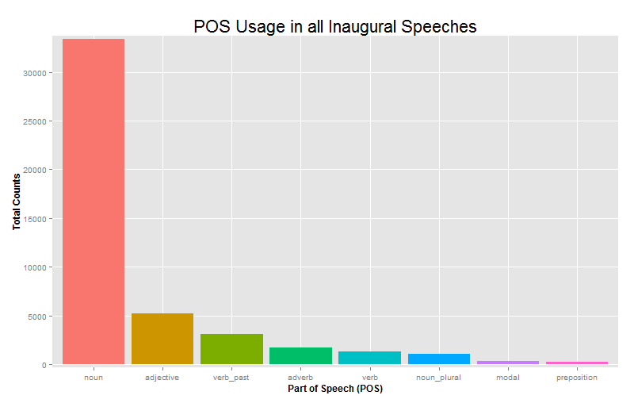
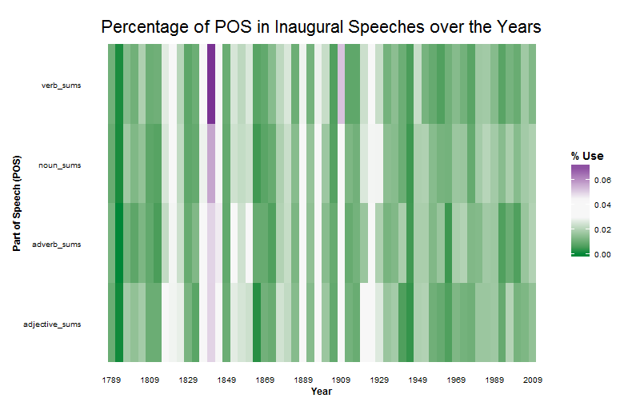
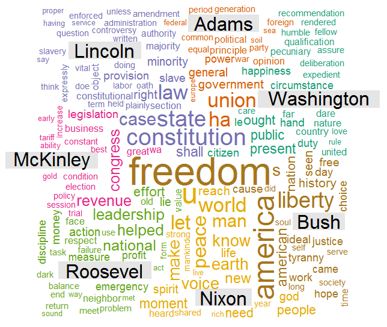

Homework 4: Text Visualization
==============================

| **Name**  | Charles Yip |
|----------:|:-------------|
| **Email** | ckyip@dons.usfca.edu |

## Instructions ##

Instruction for running the official code is down below. I used both python and R. Python was used to retrieve the data and do simple text analytics on the data. The python script produces the csv's required to produce the visualizations from the R code. 

The following Python Librarys should be installed before running the Python code:
- `nltk`
- `sklearn`
- `numpy`

To run this code, please do the following:

```
1. Download or copy the inaugural.py file from the following link:
https://raw.github.com/chrono721/msan622/homework4/
2. Run the script in python
```


The following  R packages must be installeded before running the R code:
- `ggplot2`
- `scales`
- `wordcloud`
- `reshape`

To run this code, please enter the following commands in R. MAKE SURE TO HAVE THE csv FILES BEFORE RUNNING:

```
library(devtools)
source_url("https://raw.github.com/chrono721/msan622/homework4/Homework4.R")
```

## About the Data ##

For this assignment, I decided to take a look at all of the inaugural addresses up until 2003. This information is provided within nltk's package: nltk.corpus.inaugural.

To extract the words, I used sklearn's vectorizers using a lemmatizer, a stemmer and removing stop words in order to get a list of tokens back. 

For each address, I produced a total of 4 csv files that R will use to create the plots:
-`counts.csv` : Contains the counts of each word in each document
-`tfidf.csv`: Contains the tfidf measure for each word.
-`word.csv`: Contains the list of all the words used and their part of speech.
-`info.csv`: Contains the information about each document: Year given and the President who gave it.

## Discussion ##

Below I will talk about each plot and some interesting discoveries about each plot:



What we have here is a time series plot of six words that have been used in the inaugural address over the years. We can see that over the years, the words such as "State", "Power", and "Constitution" have all declined in usage over the years. Conversely, words such as "World", "America", and "New" have all gone up in use. My speculation for this is that after1909, the US started to focus less on the individual states, and began to focus on the whole counctry and its role in the world. 

To produce this graph, the count.csv file was used which contained the word counts over the years. To figure out which words to print, I summed the first half of the data and summed the last half of the data and then chose words with the biggest difference. 

The inaugural speeches all happened every 4 years. Unfortunately, that means the x-axis is labeled rather strangely. I chose to keep it this way because the ticks will actually denote when the speech happened. Also, I chose to plot all words together so that we can see an overall general trend in the data. I facetted the declining words and the increased words because putting them together would create a mess and be hard to see the general trend. 

Lie-Factor: close to 1 - Line plots make it hard to mincontrue the data since it is all in 2D. 

Data-Ink Ratio: LOW - Line plots generally have low data-ink.

Data Density: PRETTY LOW - plotting 3 lines at the same time makes it a little dense.



What we have here is an ordered bar plot which contains the counts of the Part of Speech words used in all of the inaugural speeches. We can see that most of the speeches have lots of nouns followed by adjectives. The noun counts make sense, but the high adjective count could indicate that the speeches themselves are overly "flowery." It would be interesting to compare the ratios of the POS to other speeches. 

To produce this graph, I conducted a aggregate sum on the POS over the counts. I then ordered the dataset by their counts in order to get the ordered bar chart. 

I ended up deleting the legend as the labels are already at the bottom. I also deleted the extra padding from the y-axis and color coded the bars for easier viewing. I debated getting rid of the nouns as it dominates the other bars, but I ultimately decided against it as I didn't know how to incorporate the noun count if it wasn't going to be in the bar chart. Perhaps a log scale would work? 

Lie-Factor: close to 1 - The bar plot starts from 0 and goes to a high number. The data is not miscontrued since this is in 2D.

Data-Ink Ratio: PRETTY LOW - The bars are pretty informative, but can take up a lt of ink.

Data Density: LOW - The bars make it clear to us where the data is and what it represents.



What we have here is a heat map displaying the percentage of the following Part of Speech tags over the years. These percentages represent the percentage of total of that perticular POS over all of the years. This is a method to scale the counts. If I did not scale, the Nouns would dominate the plot. What is interesting to note is that in ~1830, there is a high use of verbs. Perhaps some huge event happenned where the president was trying to get people to act. 

To produce this graph, I ended up aggregating over each of the chosen part of speeches and gathered their sums. I then divided that by the total number of the corresponding POS tag. This would effectively give me the percentage used. This was done so that we can track changes in POS usage over the years. 

For the plot, I ended up getting rid of the grid line, and using a green/purple gradient in order to highlight the changes. I have tried to split up each part horizontally, bit when I tried to do that, the plot ended up looking worse. I think keeping it all in one huge block is fine for our purposes. In addition, the year labels could've been less frequent. Since the heatplot focuses on the general trend, the year labels tend to distract from the overall trend.  

Lie-Factor: close to 1 - All of the bins are equally sized. 
Data-Ink Ratio: PRETTY HIGH - Using all of this color makes it very ink intensive.
Data Density: PRETTY HIGH -Heat maps make it hard to tell exactly what is happenning, but it is to gather a sense of the general trend. A lot of data is going into this plot.



What we have here is a wordcloud based on the word frequencies made by the presidents. We can se here that Freedom is the most dominant word out of all the other presidents. Looking at this plot can give us a sort of impression of what message they were trying to give to the people. Ultimately, this would give us an idea of what ideals each president has. 

To produce this graph, I needed to convert the counts into a matrix as wordcloud package only accepts matrices for certain functions. I selected certain presidents every ~30 years in order to get a broad spectrum of presidents. I then converted that data into a matrix and fed it into the function.

I chose this kind of plot because I wanted to color code the words by their respective presidents. A simple word cloud would not give us a lot of information, but using this helps us compare much easier. I should've filtered out some of the single letter words from the dataset, but I don't know how they got into the dataset in the first place. 

Lie-Factor: HIGH-Since the length of the word is not scale, longer words seem to be biggere. This is hard to fix in a word cloud though. 

Data-Ink Ratio: MEDIUM - There are a lot of words here which take up a lot of ink.

Data Density: MEDIUM - Plotting all these words makes everything feel slightly cluttered.


