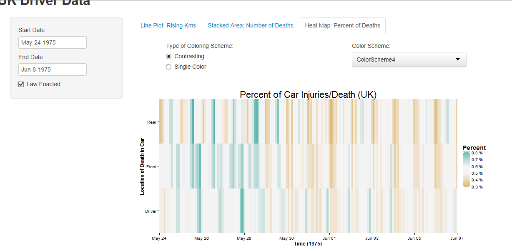

Homework 5: Time Series Visualization
==============================

| **Name**  | Charles Yip |
|----------:|:-------------|
| **Email** | ckyip@dons.usfca.edu |

## Instructions ##

My `shiny` app should be able to run remotely using the following code:

```
library(shiny)
runGitHub("msan622", "chrono721", subdir = "homework3")
```

Also, please have the following libraries installed to run the code:

- `RColorBrewer`
- `ggplot2`
- `shiny`
- `scales`
- `datasets`

## About the Data ##

For this assignment, I decided to take a look at all of the inaugural addresses up until 2003. This information is provided within nltk's package: nltk.corpus.inaugural.

To extract the words, I used sklearn's vectorizers using a lemmatizer, a stemmer and removing stop words in order to get a list of tokens back. 

For each address, I produced a total of 4 csv files that R will use to create the plots:
-`counts.csv` : Contains the counts of each word in each document
-`tfidf.csv`: Contains the tfidf measure for each word.
-`word.csv`: Contains the list of all the words used and their part of speech.
-`info.csv`: Contains the information about each document: Year given and the President who gave it.

## Discussion ##

Below is a discussion of my Shiny application. The interactivity included allows you to Zoom in on a certain time period. If an invalid date range is selected, a text will appear telling you have done so and revert to the default settings. 

For each of the graphs, I have also included a Red line indicated when the Seatbelt law has been passed. I understand that this line can sometimes be distracting, so I included an option to remove the line. 


What you see here is a line plot of the distances travelled during a specific day. We can see from the data that there seems to be some sort of seasonality to the data as we can see cyclical nature to the data. 

In addition to the plot, we can see how the petrol price affects the distance driven. The slider will give us a point on the line where the petrol price was above that amount. I hoped see that when the petrol price was high, the dots will fall on the valleys of the line. However, this was not the case. 

Lie-Factor: CLOSE TO 1 - Line plots make it hard to misconstrue the data since it is all in 2D. 

Data-Ink Ratio: LOW - Since there is a single line, there is no need for a lot of ink.

Data Density: PRETTY LOW - Depends on if you decide to plot all the petrol prices. If you decide to do that, then the data density would be pretty high, but the point of this slider is to test higher prices. 


What you see here is a stacked area plot contain the counts of the deaths or serious injuries. I decided to only count the Drivers, Front, and Backseat passengers in this count. You can see that I give the user 2 options to change between counts or percentage. In general, I find that using counts makes the area plot hard to compare values. Thus, that is why the percent option is here. We will be able to see the percent breakdown of deaths/injuries this way. 

I realize that these values do not show the whole picture are the number of driver deaths in general are probably correlated to the number of drivers out there. The data did not provide this values though. 

Lie-Factor: HIGHER THAN 1 - Areas are a little hard to compare to each other, but the addition of the percent plot makes it a little easier to make a judgement. 

Data-Ink Ratio: HIGH - There is a lot of ink being use in these plots. Even though there are only 3 lines, the area still counts towards the data. 

Data Density: PRETTY LOW - There is not a lot of information contained in this plot. Even though there is a lot of area, we can clearly see the ratios and the area counts. 



The last plot I have is a heat map containing the percentages of the Drivers, Front, and Backseat passengers who died or had serious injuries. This is another way to visualize the Stacked Area percentage, but this makes it a lot easier to determine if each component has a cyclical nature. 

By changing the color palette between contrasting and single-color, we can come up with different conclusions about the data. We can look for the maximum values or we can look to see if there are very high or low injury days. 

Lie-Factor: A LITTLE HIGHER THAN 1 - The boxes are all even, but sometimes the colors blur the values close to white. 

Data-Ink Ratio: MEDIUM - Heatmaps use a lot of ink, but because of the use of white space, there is not too much in these ones.

Data Density: PRETTY LOW - The data is not dense enough so that we can't see the trends in the data.


