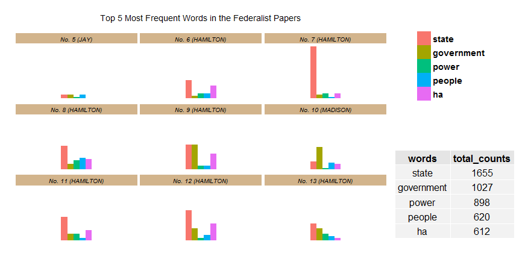
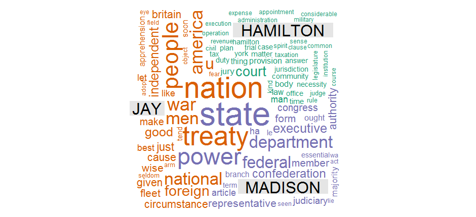
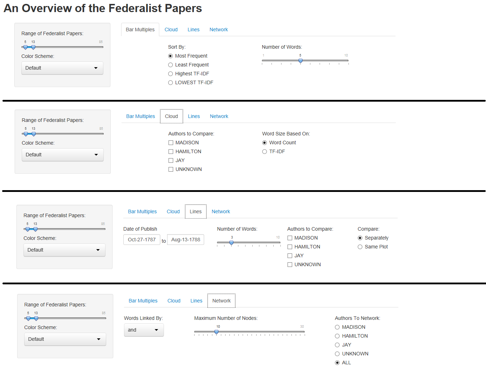

Project: Prototype
==============================

| **Name**  | Charles Yip  |
|----------:|:-------------|
| **Email** | ckyip@dons.usfca.edu |


Instructions To Run Shiny App
------------------------------
To run the prototype shiny app, you can run the following:

```
library(shiny)
runGitHub("msan622", "chrono721", subdir = "prototype")
```

If you would like to run the R program to produce the example plots, I would highly suggest that you copy the code up until the part where it says "Not Done" into your own R. You will be able to see the start of the other plots as well. Please note that you must download all the .csv files as well.

To run the plots, you must have these packages installed:

- `ggplot2`
- `scales`
- `reshape`
- `wordcloud`
- `gridExtra`


About the Dataset
------------------------------
The dataset I chose to visualize is the raw text file containing the entire corpus of the 85 Federalist Papers. At the time, the authorship of these papers were unknown until a list of authors for each paper was discovered. However, 13 of these papers were never classified. These papers have been studied numerous times in order to determine the authorship of these unclassified papers. 

The raw dataset needs to be transformed into other forms before I can visualize it. I currently have:

- basic.csv: Contains the basic information about each paper (the author and when it was written)
- counts.csv: Contains the counts of each word in each paper. I removed stop words and only included counts of words of at least 5.
- POS.csv: Contains the part of speech for each of the words.

Eventually, I will also need to produce these datasets as well:
- tfidf.csv: Will contain the tfidf for each word and document
- network.csv: Will contain the counts of tri-grams that contain a "connecting" word like 'of', 'and', etc.


Prototype
------------------------------
Directly Below are some example images of the kinds of plots that will show up in the final project.



This is a small multiples plot of the word counts in each Federalist paper. The selected bars contains the overall more frequent words, while the small multiples are supposed to show you the breakdown. The table added on the side contains the counts for all of the papers. This will allow the viewer to gain some perspective on the number of words.




This is a comparison wordcloud that displays the word frequencies used by the authors. It is a little hard to get around the lie factor here, but the point of this plot is to showcase the different vocabulary used by each of the authors. I may also decide to include stop words here too since according to studies, they are also a pretty differentiating factor between the authors. 




This is a basic overview of the shiny app that I will produced. As you can see, it contains a wide variety of options for all of the graphs. 

On the sidebar, it contains general settings for each of the plots. I wanted the user to be able to select certain federalist papers to use in the visualizations, but I do not know if there is an efficient and neat way to do this in shiny. I might end up taking out this option later. The color scheme will change the colors used throughout all of the visualizations. 

For the Small Multiples, I will implement:
- Sorting by counts and tfidfs
- Allowing for more words to be plotted

For the Comparison Cloud, I will implement:
- An option to subset by authors
- How the size of the words are determined

For the Multiple Line plot, I will implement:
- Zooming based on a date range
- The ability to plot more words
- An option to subset by authors
- An option to facet the plots, or to plot all the lines in one giant plot

For the Network Graph, I will implement:
- A choice to change the linking word
- An option to increase/decrease the size of the network
- An option to subset by certain author


